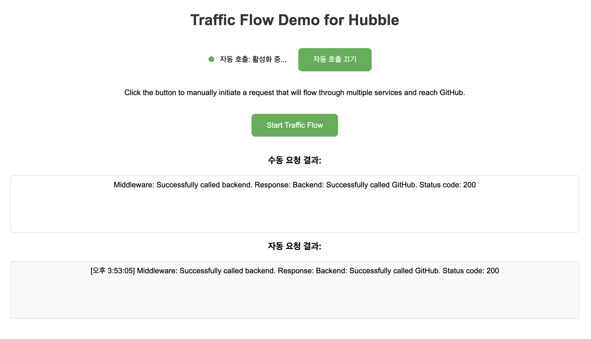
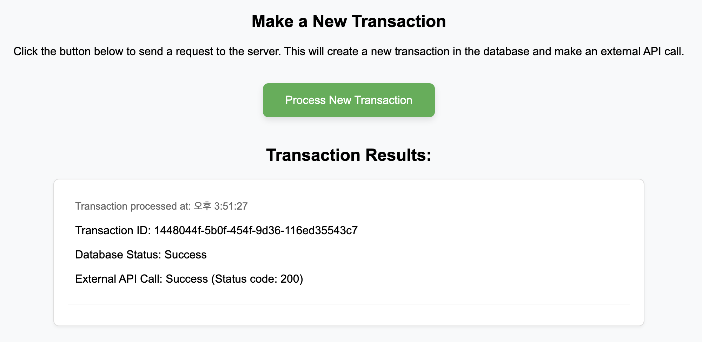

# k8s-sample-app-lab

쿠버네티스에 배포할 YAML 파일 모음 및 샘플 애플리케이션 레포지토리

## 1. traffic-flow-demo
자동 및 수동으로 트래픽을 발생시키는 샘플 애플리케이션  
frontend, middleware, backend로 구성된 3계층 아키텍처

### 사용 예시

1. 웹 인터페이스에 접속하면 "Traffic Flow Demo for Hubble" 페이지가 로드
2. "Start Traffic Flow" 버튼을 클릭하여 수동으로 요청 시작
3. 자동 트래픽 생성은 기본적으로 활성화되어 있으며, "자동 호출 끄기/켜기" 버튼으로 제어 가능
4. 요청 결과는 각각 "수동 요청 결과"와 "자동 요청 결과" 섹션에 표시

 

## 2. flash-store-demo
3-티어 아키텍처의 샘플 스토어 애플리케이션(web-was-db)

### 사용 예시

1. 사용자가 웹 인터페이스에서 "Process New Transaction" 버튼 클릭
2. frontend는 /api/transaction 엔드포인트로 요청을 보냄
3. Nginx는 이 요청을 WAS 서비스로 프록시
4. WAS는 MongoDB에 트랜잭션 데이터를 저장, 외부 API(GitHub)를 호출, 성공/실패 상태와 함께 결과 반환
5. frontend가 결과 표시

### 주의 사항
nks-nas-csi StorageClass는 NCP 종속적이므로, 다른 환경 & CSP에 배포할 때는 적절한 StorageClass로 변경 필요